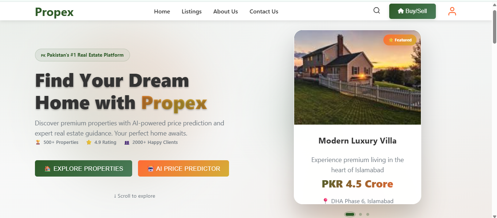
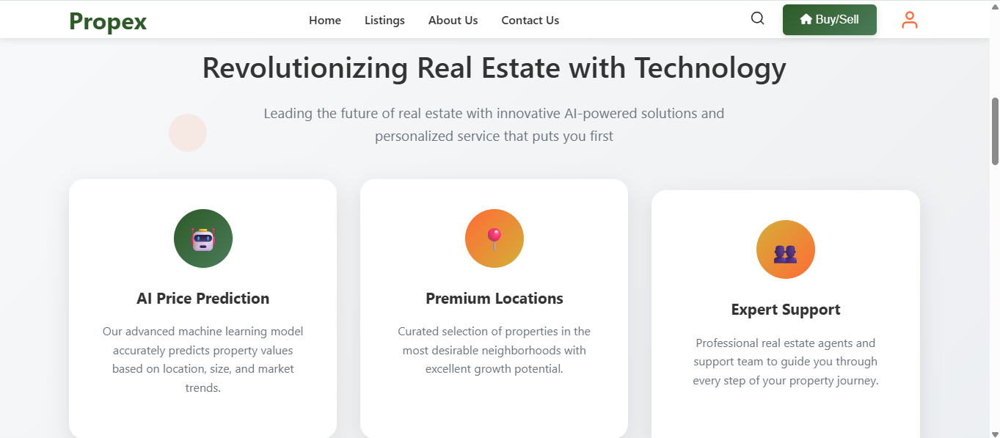
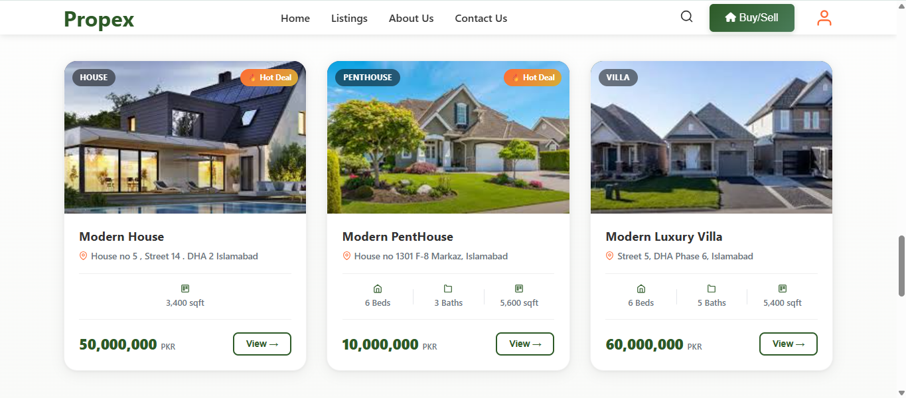
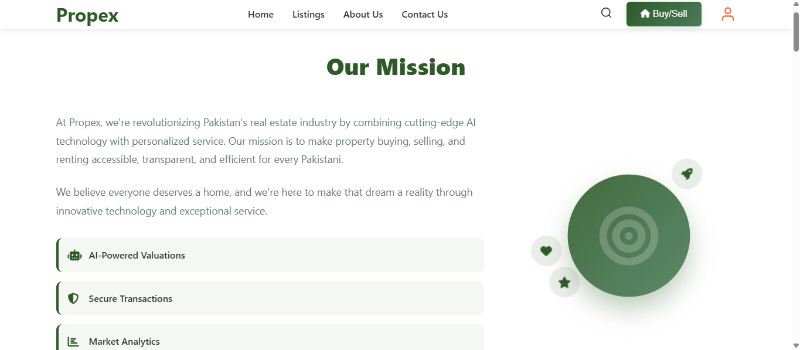
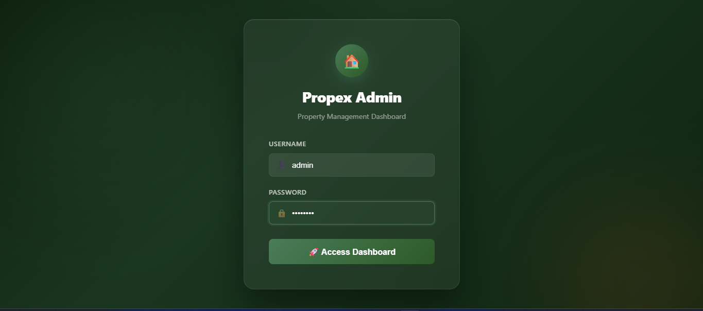
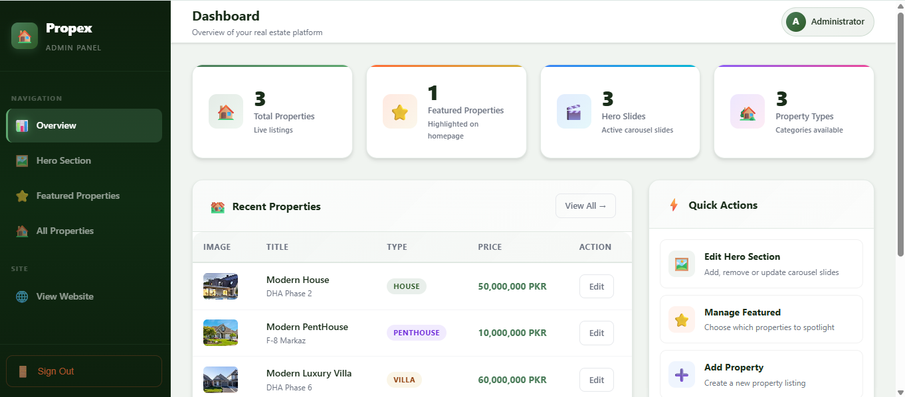
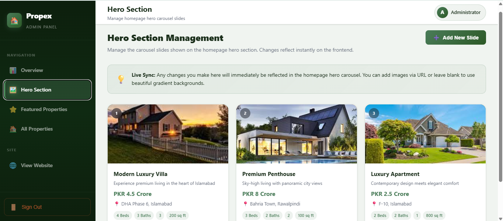
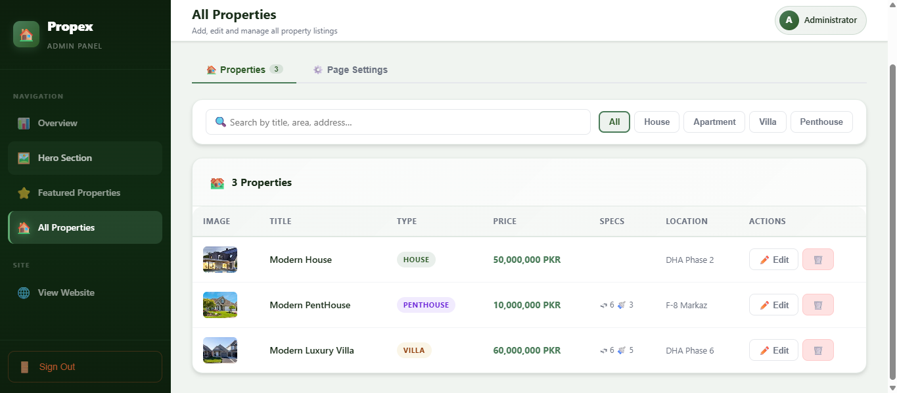

# Propex - Real Estate Platform

Propex is a full-stack real estate web app with a React frontend and a Node/Express API backed by PostgreSQL. It also includes an optional Flask service that exposes a demo ML price prediction endpoint. The UI focuses on property discovery, curated listings, and an admin dashboard for managing content.

## Key Features

- Public website with hero carousel, featured properties, listing filters, and detailed property views
- Admin dashboard (demo session auth) to manage listings, hero slides, featured selections, and listing page settings
- Image uploads with drag-and-drop and URL mode; images served from /uploads
- Analytics utilities for property/page tracking (client-side) plus server analytics endpoints
- REST API for properties CRUD, hero slides, featured list, and listing settings
- Optional ML price prediction API (Flask + scikit-learn) with market trends

## Tech Stack

### Frontend
- React 18
- React Router
- Framer Motion
- Axios
- CSS

### Backend API (Node)
- Express
- PostgreSQL (pg)
- Multer (file uploads)
- Helmet, CORS, rate limiting, compression, Morgan

### ML Service (Optional)
- Flask
- scikit-learn, pandas, numpy

## Project Structure

```
propex/
├── backend/
│   ├── server.js                 # Node/Express API
│   ├── app.py                    # Flask ML service (optional)
│   ├── data/                     # JSON storage (hero slides, featured ids, listing settings)
│   ├── uploads/                  # Uploaded images
│   ├── routes/                   # Flask blueprints
│   └── models/                   # Flask SQLAlchemy models
├── database/
│   └── schema.sql                # PostgreSQL schema
├── frontend/
│   ├── public/
│   └── src/
│       ├── components/
│       ├── pages/
│       ├── pages/admin/
│       └── utils/
└── README.md
```


## Setup

### 1) Database
- Create a PostgreSQL database and run database/schema.sql.
- Create backend .env with DATABASE_URL (and optional CORS_ORIGIN, RATE_LIMIT_*).

### 2) Backend API (Node/Express)
```
cd backend
npm install
npm run dev
```
API runs at http://localhost:5000.

### 3) Frontend (React)
```
cd frontend
npm install
npm start
```
App runs at http://localhost:3000.

### 4) Optional ML Service (Flask)
If you want the demo price prediction endpoints:
```
cd backend
python -m venv venv
venv\Scripts\activate
pip install -r requirements.txt
python -m flask --app app:create_app run --port 5001
```

## API Highlights

### Node API (http://localhost:5000)
- GET /health
- GET /api/health/db
- GET /api/properties
- POST /api/properties
- GET /api/properties/:id
- PUT /api/properties/:id
- DELETE /api/properties/:id
- GET /api/hero-slides
- POST /api/hero-slides
- PUT /api/hero-slides/:id
- DELETE /api/hero-slides/:id
- GET /api/featured-properties
- PUT /api/featured-properties
- GET /api/settings/listing
- PUT /api/settings/listing
- POST /api/upload
- GET /api/admin/stats
- GET /api/analytics/properties

### ML Service (http://localhost:5001)
- POST /api/prediction/predict
- GET /api/prediction/market-trends

## Admin Demo Login
- Username: admin
- Password: admin123

## Notes

- The admin login is a demo client-side session check (sessionStorage).
- The public auth modal/login page are UI stubs; backend auth endpoints exist in the Flask service but are not wired to the React UI.
- Hero slides, featured selections, and listing settings are stored as JSON in backend/data.
- The ML model uses sample data for demonstration and should be replaced with real training data for production.

## Screenshots








